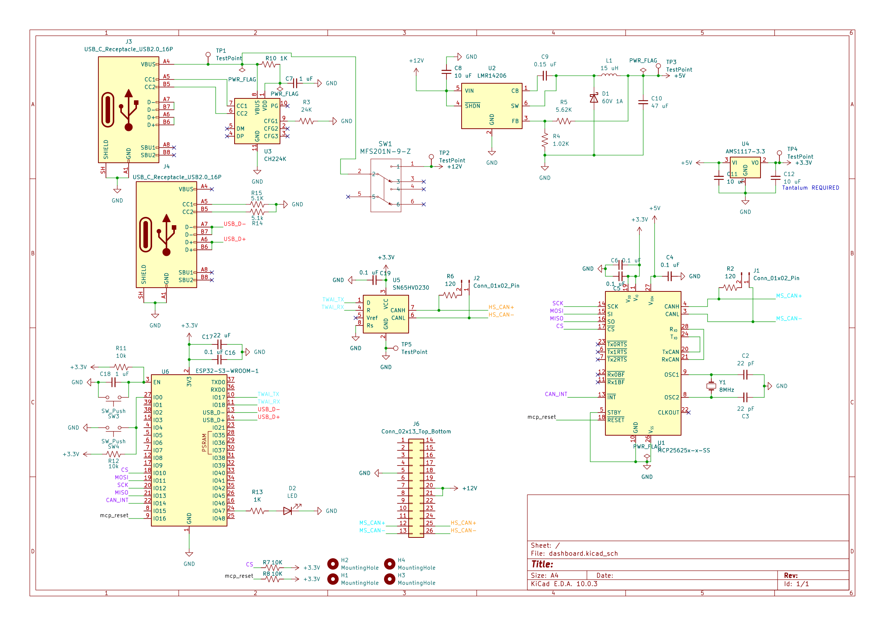
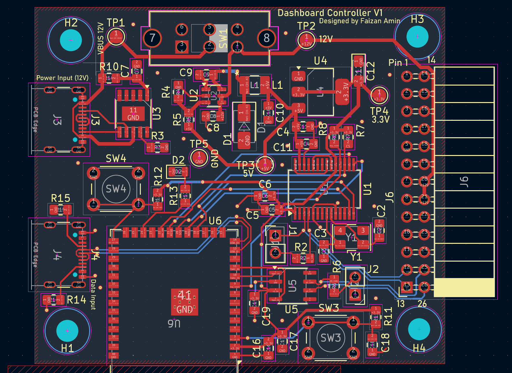

# Dashboard-Controller
A custom ESP32 hardware interface and firmware for reverse engineering and controlling a 2011 Ford Fusion instrument cluster.
   

## Cluster Pinout
Pin 5 - Ground 
Pin 20 - 12V 
Pin 21 - 12V 
Pin 25 - HS_Can+ 
Pin 26 - HS_Can- 
Pin 12 - MS_Can+ 
Pin 13 - MS_Can- 
 
## PCB Schematic 1st Revision

## PCB Layout 1st Revision

